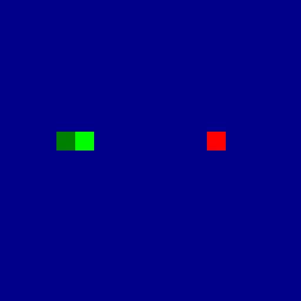
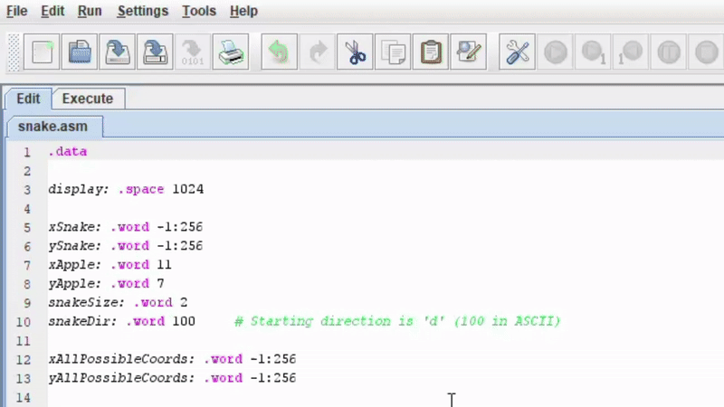
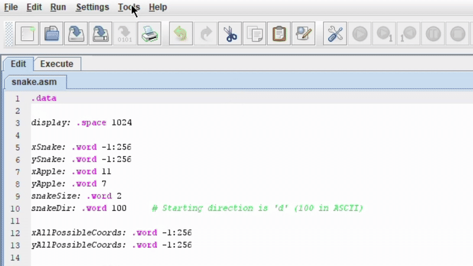
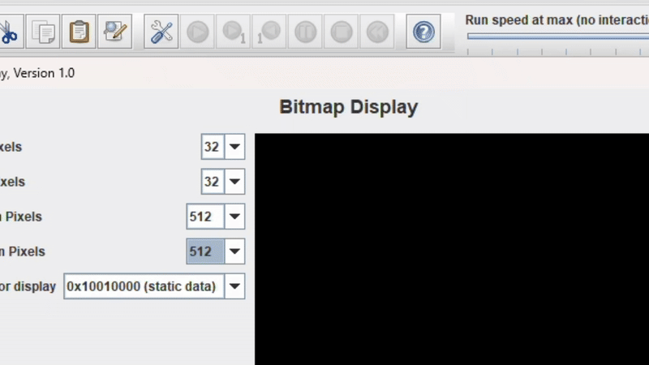
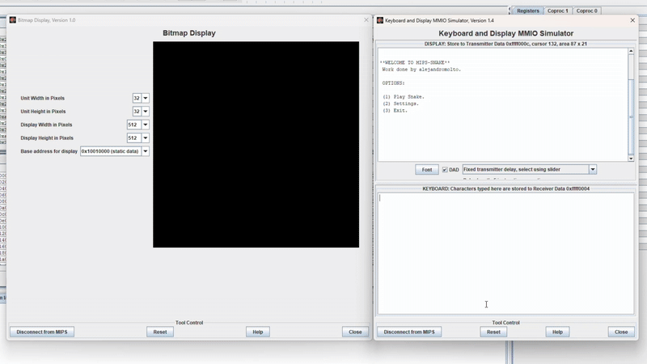

# Snake Game in MIPS Assembly

A classic **Snake** implementation written in **MIPS assembly** for the **MARS** simulator.  
This repository is an educational project that demonstrates low-level programming concepts such as **memory-mapped I/O (MMIO)** or **bitmap graphics**.



---

## Features
- Menu navigation and keyboard-driven UI.  
- Snake movement via **WASD**.  
- Real-time graphics using MARS **Bitmap Display**.  
- Implemented entirely in **MIPS assembly** (no external libraries).

---

## Requirements
- [MARS MIPS Simulator](http://courses.missouristate.edu/kenvollmar/mars/) (recommended).

---

## Usage

1. Open `snake.asm` in **MARS**.

2. Load the **MMIO Keyboard and Display** tool in MARS.  
   

3. Load and configure the **Bitmap Display** tool.  
   

4. Assemble the program and run it.  
   

5. Use the menu to start a game and control the snake.  
   

**Notes**
- If the Bitmap Display resolution or unit size is wrong, the graphics will appear distorted. Use the configuration shown in the GIFs (32 bits unit height and width, 512 pixels display height and width).  

---

## Contributions 
Contributions are welcome and greatly appreciated, whether it's a bug fix or a new mechanic. To contribute, follow these steps:

1. **Fork** the repository.
```bash
git clone https://github.com/alejandromolton/MIPS-Snake.git
cd MIPS-Snake.git
```

2. **Create a branch** for your feature or bugfix.
```bash
git checkout -b feature-name
```

3. **Make your changes** and **commit them**.
```bash
git commit -m "Add a descriptive message"
```

4. **Push to your branch.**
```bash
    git push origin feature-name
```

5. **Open a Pull Request here on GitHub and describe your changes.**
   Go to the fork you created and generate a pull request, provided with a clear title and description of your changes.

## About

This project is purely educational. I built it to better understand the MIPS architecture and to practice writing software in assembly. I plan to study additional assembly architectures in the future.
